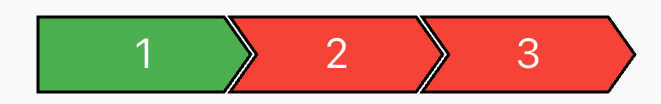

# progress_stepper

This package can be used to create custom stepper.

## Main Classes

| Class                                                                          | Description                                                    |
|--------------------------------------------------------------------------------|----------------------------------------------------------------|
| [ProgressStepper](lib/src/progress_stepper.dart)                               | You have to initialise this class to create the custom stepper |
| [ProgressStepWithChevron](lib/src/progress_step_with_chevron.dart)             | Custom step with the shape of an arrow                         |
| [ProgressStepWithArrow](lib/src/progress_step_with_arrow.dart)                 | Custom step with the shape of chevron                          |
| [ProgressStepWithBluntChevron](lib/src/progress_step_with_blunt_chevron.dart)  | Custom step with the shape of chevron, without pointed head    |

## Usage

You can use this control in two ways:

### Method 1

You just need to initialise the ProgressStepper with required values, it will create a default
progress step with chevron type.

```@dart
ProgressStepper(
   width: 300,
   currentStep: 1,
)
```

The above code will create a stepper as shown below:


---

#### Stepper with both end blunt

```@dart
ProgressStepper(
   width: 300,
   height: 20,
   bluntHead: true,
   bluntTail: true,
   color: Colors.grey,
   progressColor: Colors.deepPurple,
)
```
Which will result in:


### Method 2

You can use the builder to return your own custom step or use the provided steps as you need.

```@dart
ProgressStepper(                              
   width: 200,
   height: 25,
   color: Colors.red,
   progressColor: Colors.green,
   stepCount: 3,
   builder: (index) {
      double widthOfStep = 200 / 3;
      if (index == 1) {
         return ProgressStepWithArrow(
            width: widthOfStep,
            defaultColor: Colors.red,
            progressColor: Colors.green,
            wasCompleted: true,
         );
      }
      return ProgressStepWithChevron(
         width: widthOfStep,
         defaultColor: Colors.red,
         progressColor: Colors.green,
         wasCompleted: false,
      );
   },
)
```

The above code will create a stepper as shown below:

